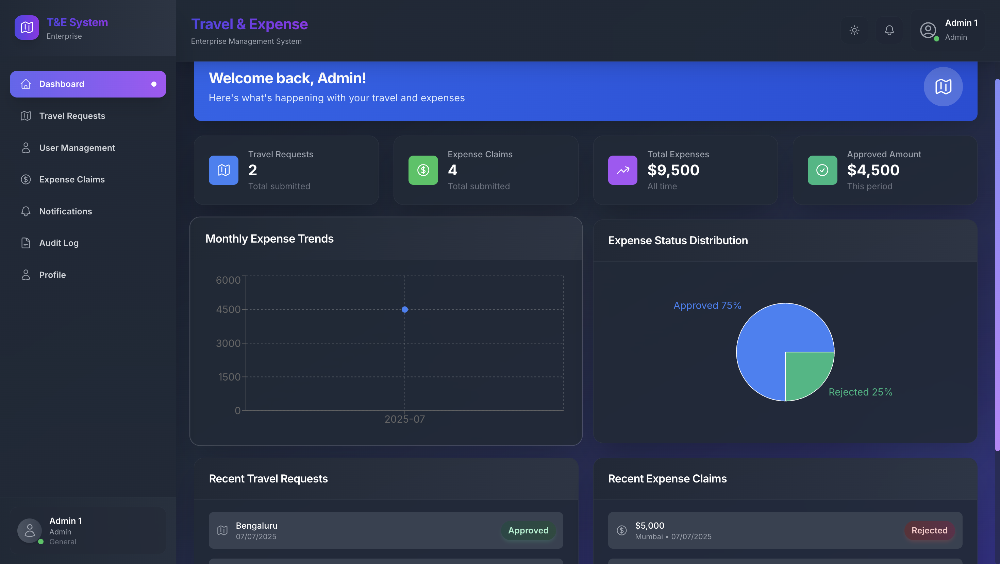
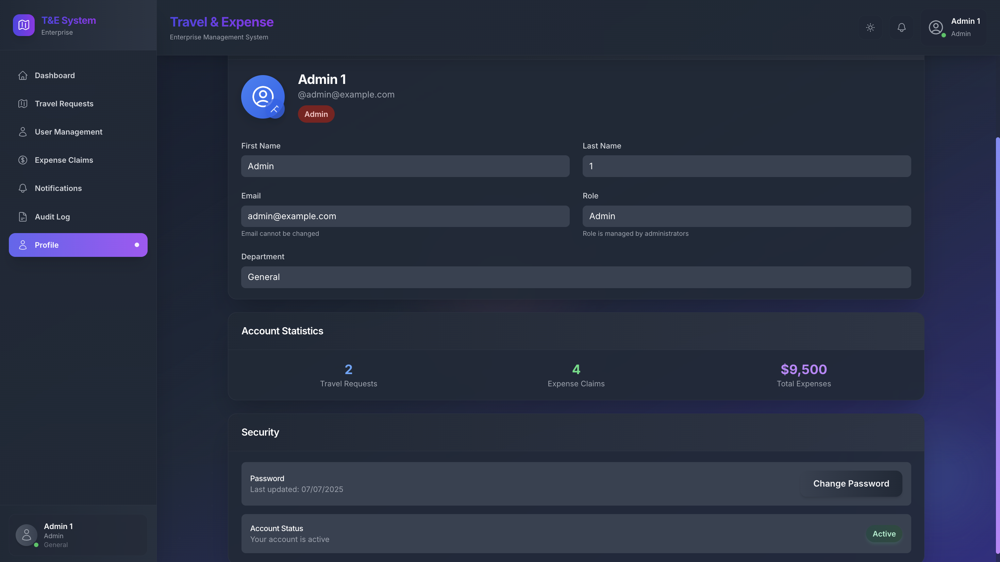
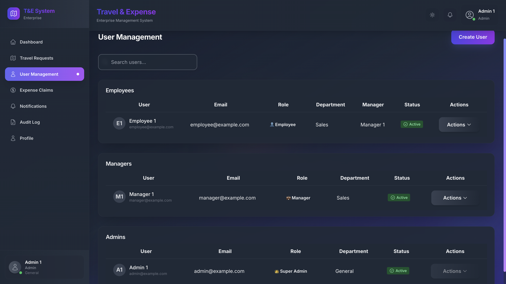
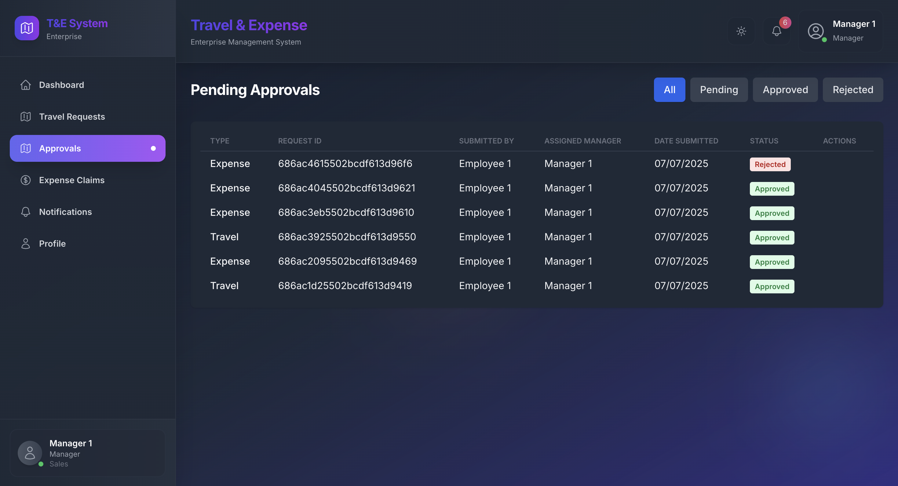
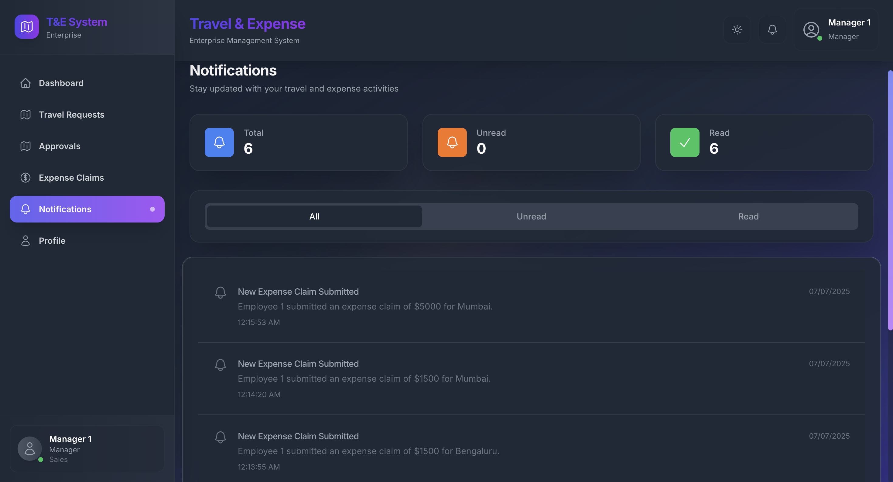
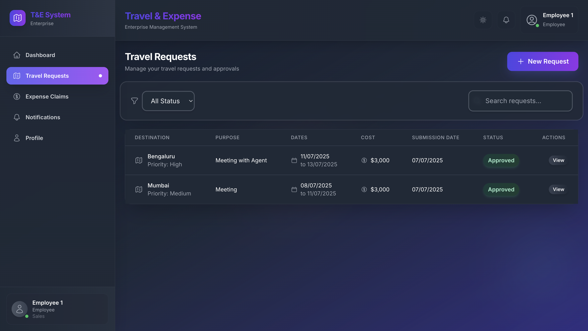
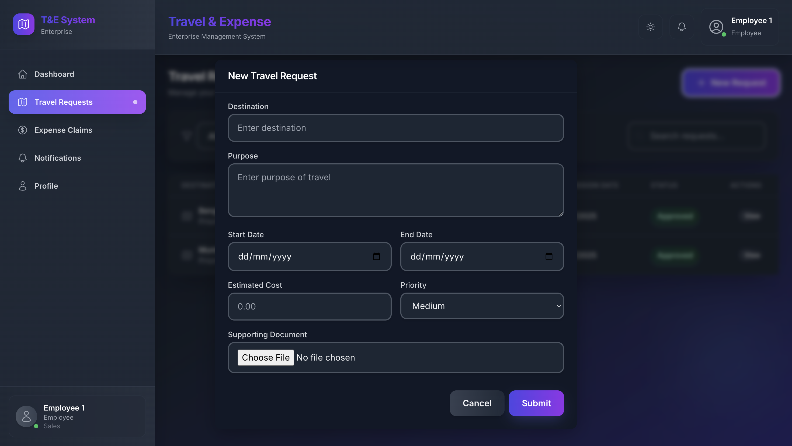
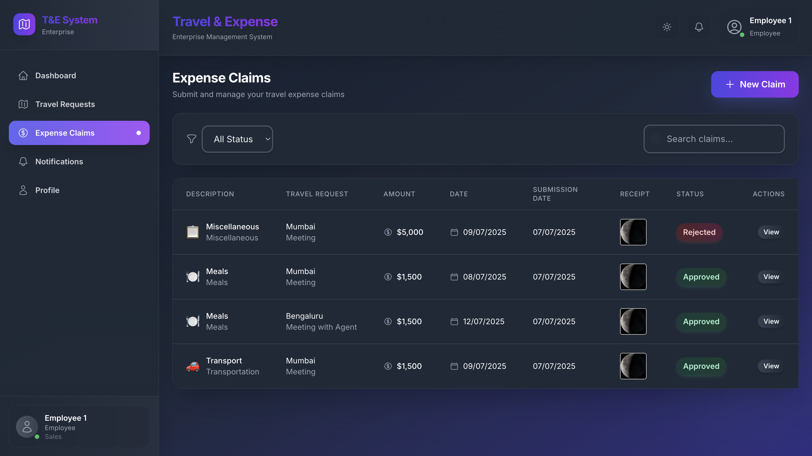

# 🧳 Enterprise Travel & Expense Management System

A robust MERN stack application for enterprises to streamline travel and expense tracking, featuring multi-level approvals, role-based access control, real-time notifications, and secure authentication.

---

## 📝 Overview

Enterprise Travel & Expense Management System is designed for modern organizations to manage travel requests and expense claims efficiently. It supports multi-level approvals, role-based dashboards, audit logging, and real-time/email notifications, ensuring compliance and transparency in corporate workflows.

---

## 🚀 Features

| Feature                        | Description                                                        |
|--------------------------------|--------------------------------------------------------------------|
| Role-Based Access Control      | Employee, Manager, Admin, Super Admin roles                        |
| Multi-Level Approval Workflow  | Manager/Admin/Super Admin-based routing                            |
| Real-Time Notifications        | Socket.IO for instant alerts, plus email notifications (Nodemailer)|
| Audit Logging                  | Full request/claim history with advanced filtering                 |
| CSV Export                     | Export all or filtered data to CSV                                 |
| Secure Authentication          | JWT, bcrypt, Helmet, CORS, Rate Limiting                           |
| Responsive UI & Dark Mode      | Mobile-friendly, modern design, dark mode toggle                   |
| Attachment Support             | Upload bills/documents securely                                    |
| Password Management            | Change/reset password securely                                     |

---

## 🔐 Role-Based Access & Workflow

### User Roles & Privileges
- **Employee:** Submits travel/expense requests, views own status.
- **Manager:** Reviews/approves/rejects team requests, cannot act on own.
- **Admin:** Manages all users, requests, audit logs, and roles.
- **Super Admin:** Full privileges, cannot be deleted, can promote any user to Admin.

### Password & Account Management
- Users can change/reset passwords securely (profile or email link).
- Passwords are hashed; reset via secure email link (Nodemailer).

### Admin & Super Admin Controls
- Activate, deactivate, or delete users (except Super Admin).
- Promote/demote between Employee and Manager.
- Assign/reassign Managers to Employees.
- No user can delete/deactivate themselves.

### Workflow & Validation Logic
- No past dates for travel/expense forms.
- Expense claims must fall within approved travel dates.
- Required fields and documents enforced.
- Once Admin acts, Managers cannot further approve/reject.

---

## 📸 Screenshots 

### 👩‍💼 Admin Dashboard
- 
- 
- 
- 

### 👨‍💼 Manager Dashboard
- 
- 

### 👷‍♂️ Employee Dashboard
- 
- 
- 
- 

---

## ⚙️ Tech Stack

**Frontend:**
- React.js (with Hooks & Context API)
- Tailwind CSS (utility-first styling)
- React Router (SPA routing)
- Axios (API requests)
- Socket.IO Client (real-time notifications)
- React Toastify (user alerts)

**Backend:**
- Node.js (runtime)
- Express.js (REST API framework)
- MongoDB (NoSQL database)
- Mongoose (ODM for MongoDB)
- Socket.IO (real-time communication)
- Nodemailer (email notifications)
- JWT (authentication)
- bcrypt (password hashing)
- Helmet, CORS, Express Rate Limit (security)

---

## 🛠️ Installation

```bash
git clone https://github.com/Kush-Varshney/Enterprise-Travel-Expense-System.git
cd Enterprise-Travel-Expense-System

# Backend
cd server
npm install

# Frontend
cd ../client
npm install
```

## 🏃‍♂️ Running the Project

### 1. Seed the Database (Required for First-Time Setup)

You must run the seed script to create initial users (such as admin accounts) before logging in.

```bash
cd server
node scripts/seed.js
```

### 1.1 Default Seeded Users

After running the seed script, you can log in with the following default accounts:

| Role     | Email                | Password     |
|----------|----------------------|-------------|
| Admin    | admin@example.com    | admin123    |
| Manager  | manager@example.com  | manager123  |
| Employee | employee@example.com | employee123 |

> **Note:** You can change these credentials in `server/scripts/seed.js` before running the script if you want custom users.

### 2. Start the Backend Server

```bash
node server.js
```
# or, for auto-reload on changes
```bash
npx nodemon server.js
```

### 3. Start the Frontend

Open a new terminal, then:

```bash
cd client
npm start
```

---

## 🌐 Environment Variables

### Server (`server/.env`)
```env
PORT=4000
MONGODB_URI=your_mongodb_connection_string
JWT_SECRET=your_secret_key
EMAIL_USER=your_email@example.com
EMAIL_PASS=your_email_password
CLIENT_URL=http://localhost:3000
EMAIL_FROM=Travel Expense System <noreply@yourdomain.com>
```

### Client (`client/.env`)
```env
REACT_APP_API_URL=http://localhost:4000
```

---

## 📂 Folder Structure

```
Enterprise-Travel-Expense-System/
│
├── README.md
├── .gitignore
│
├── screenshots/
│   ├── admin-dashboard.png
│   ├── audit-log.png
│   ├── approval-detail.png
│   ├── expense-claim-form.png
│   ├── expense-claim-list.png
│   ├── notification-page.png
│   ├── travel-request-form.png
│   ├── travel-request-list.png
│   ├── user-management.png
│   └── user-profile.png
│
├── client/
│   ├── package.json
│   ├── package-lock.json
│   ├── tailwind.config.js
│   ├── postcss.config.js
│   ├── public/
│   │   ├── favicon.svg
│   │   ├── index.html
│   │   └── manifest.json
│   └── src/
│       ├── App.js
│       ├── index.js
│       ├── index.css
│       ├── .env.example
│       ├── components/
│       │   ├── Header.js
│       │   ├── Layout.js
│       │   ├── LoadingSpinner.js
│       │   ├── ProtectedRoute.js
│       │   └── Sidebar.js
│       ├── contexts/
│       │   ├── AuthContext.js
│       │   ├── NotificationContext.js
│       │   └── ThemeContext.js
│       └── pages/
│           ├── Approvals.js
│           ├── AuditLog.js
│           ├── Dashboard.js
│           ├── ExpenseClaims.js
│           ├── Login.js
│           ├── Notifications.js
│           ├── PendingApproval.js
│           ├── Profile.js
│           ├── Register.js
│           ├── ResetPassword.js
│           ├── TravelRequests.js
│           └── UserManagement.js
│
├── server/
│   ├── package.json
│   ├── package-lock.json
│   ├── server.js
│   ├── .env.example
│   ├── scripts/
│   │   └── seed.js
│   ├── middleware/
│   │   └── auth.js
│   ├── models/
│   │   ├── AuditLog.js
│   │   ├── ExpenseClaim.js
│   │   ├── Notification.js
│   │   ├── TravelRequest.js
│   │   └── User.js
│   ├── routes/
│   │   ├── auth.js
│   │   ├── dashboard.js
│   │   ├── expense.js
│   │   ├── notifications.js
│   │   ├── travel.js
│   │   └── users.js
│   └── utils/
│       └── sendEmail.js
```

---

## 📮 API Routes

| Method | Endpoint                   | Description                   |
| ------ | -------------------------- | ----------------------------- |
| POST   | `/api/auth/register`       | Register a new user           |
| POST   | `/api/auth/login`          | User login                    |
| POST   | `/api/request/`            | Create travel/expense request |
| GET    | `/api/request/mine`        | Get user's own requests       |
| PATCH  | `/api/request/:id/approve` | Approve request               |
| PATCH  | `/api/request/:id/reject`  | Reject request                |
| GET    | `/api/admin/users`         | Super Admin: View all users   |
| PATCH  | `/api/admin/user/:id/role` | Super Admin: Change user role |
| GET    | `/api/export`              | Export CSV data               |

---

## 🧠 Why This Project?

This project demonstrates:
- Real-world enterprise workflow automation
- Security best practices (JWT, helmet, bcrypt, rate limiting)
- Modular, scalable codebase (MERN stack)
- Professional UI/UX and responsive design
- Practical features for HR, finance, and admin teams

---

## 👤 Author

**Kush Varshney**  
B.Tech CSE | Full Stack Developer  
[Portfolio](https://kushvarshney.vercel.app/) • [GitHub](https://github.com/Kush-Varshney) • [LinkedIn](https://www.linkedin.com/in/kush-varshney-490baa250/)

---

## 📄 License

MIT License

---
